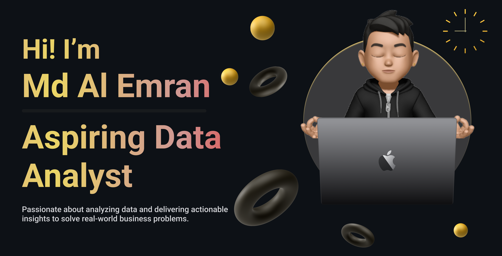
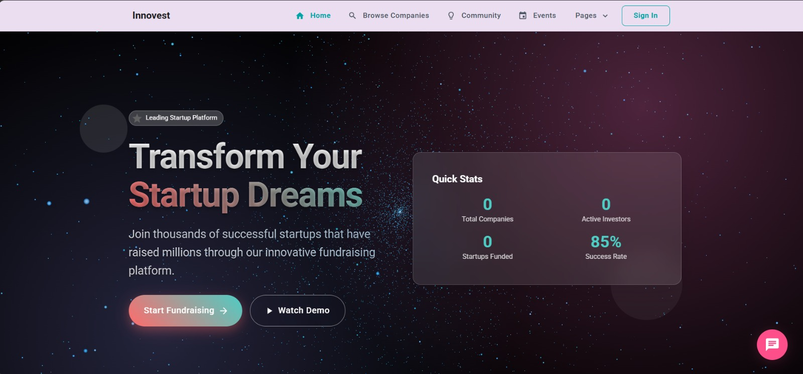
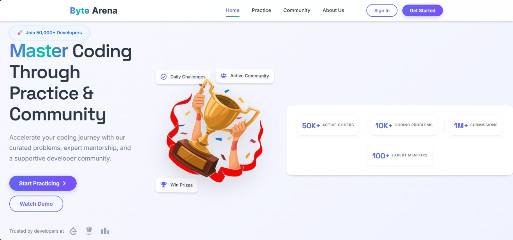

<!-- Banner -->

  

---

<!-- Headline / Tagline -->

  <em>Final-year CSE student | Data Analyst & ML Enthusiast | Building data-driven solutions to solve real-world problems</em>

---

<!-- Heading & CTAs -->

 
  
  

---

## 👋 About Me  

I am **Md Al Emran**, a final-year *Computer Science and Engineering* student specializing in **Data Science and Machine Learning.
My primary interest lies in developing data-driven solutions that address real-world challenges.  

I am committed to advancing my expertise through research, practical projects, and continuous learning, with the goal of contributing to innovative technologies that create measurable impact.  

---

## 🛠️ Tech & Tools

### 🔑 Language & Frameworks

  
  
  
  
  
  
  
  
  
  
  

### 🧑‍💻 Tools & Platforms

  
  
  
  
  

### 🗄️ Database

  
  

### 🌟 Professional Strengths
- Strong problem-solving and analytical mindset  
- Effective team collaboration and communication  
- Adaptable to fast-paced and evolving environments  
- Skilled at translating data into actionable insights  
- Committed to continuous learning and professional growth  

---

## 🚀 Projects

<table>
  <!-- Innovest -->
  <tr>
    <td width="320">
      
    </td>
    <td valign="top">
      <b><a href="https://github.com/mdalemrananas/InnoVest-StartUp-Investment-Platform">Innovest — AI-Powered Fintech Platform</a></b> 
      Full-stack investor–startup matchmaking platform with AI-driven insights. 
      <b>Tech:</b> Django · DRF · React · Firebase · scikit-learn · SSLCommerz · JWT 
      <b>Highlights:</b> Developed ML pipelines with <b>90%+ prediction accuracy</b> and handled <b>5,000+ user records</b> in testing. 
      <a href="https://youtu.be/78ohsRon_a0">Live demo</a> • <a href="https://github.com/mdalemrananas/InnoVest-StartUp-Investment-Platform">Source</a>
    </td>
  </tr>

  <!-- ByteArena -->
  <tr>
  <td width="320">
    
  </td>
  <td valign="top">
    <b>
      <a href="https://github.com/mdalemrananas/ByteArena">
        ByteArena — Competitive Programming Platform
      </a>
    </b> 
    Full-stack platform for coding contests and practice problems with separate user and admin panels. 
    <b>Tech:</b> Django · DRF · React · Firebase Auth · Supabase · PostgreSQL · JWT 
    <b>Features:</b> Contest management, problem authoring system, secure submissions with automated scoring, and real-time live leaderboards. 
    <a href="https://youtu.be/l-Rd3BHpD8s">Live demo</a> • <a href="https://github.com/mdalemrananas/ByteArena">Source</a>
  </td>
</tr>

  <!-- UniEats -->
  <tr>
    <td width="320">
      
    </td>
    <td valign="top">
      <b><a href="https://github.com/yourusername/unieats">UniEats — University Canteen Management System</a></b> 
      Role-based system with dashboards, reporting, and rewards. 
      <b>Tech:</b> Java 17 · JavaFX · SQLite · MVC/DAO · JUnit 
      <b>Highlights:</b> Applied MVC/DAO design and reduced <b>load times by 25%</b> with optimized queries. 
      <a href="https://youtu.be/U79dlAFGaCU">Live demo</a> • <a href="https://github.com/yourusername/unieats">Source</a>
    </td>
  </tr>
</table>

---

## 📑 Research & Publications

<table>
  <!-- Academic Resilience -->
  <tr>
    <td valign="top">
      <b><a href="https://github.com/mdalemrananas/Machine-Learning-Paper">Predicting Academic Resilience in Students with Depression Using Machine Learning</a></b> 
      Used Gradient Boosting, Random Forest, XGBoost, SVM, and Neural Networks. 
      <b>Results:</b> Achieved <b>R² = 0.999</b> and top classification performance; clustering validated with <b>Silhouette Score</b>. 
    </td>
  </tr>

  <!-- Thesis -->
  <tr>
    <td valign="top">
      <b><a href="https://github.com/mdalemrananas/FYDP-Thesis">Deep Learning–Based Information Extraction from Bangladeshi Land Documents (Thesis)</a></b> 
      Developing OCR + NLP pipeline for Bangla land records to extract structured data and digitize governance records. 
    </td>
  </tr>
</table>

---

## 📫 Connect

  
  
  

